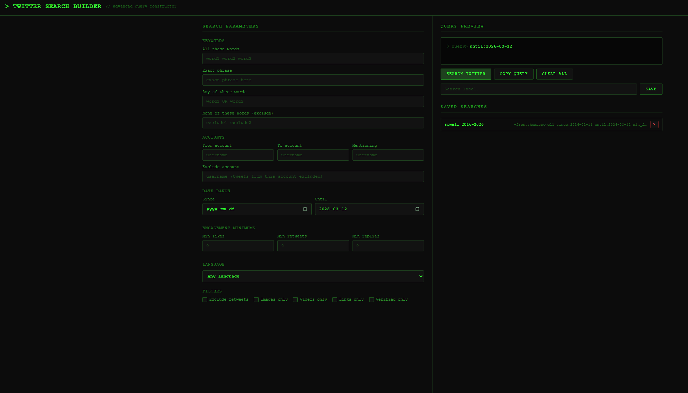

# xRay

**Advanced search tool for X.com** — build powerful search queries visually with a terminal-style interface. No frameworks, no dependencies, no build step — just open the HTML file.

## Features

- **Visual query builder** — fill in fields, get a properly formatted search query in real-time
- **Keywords** — all words, exact phrase, any of (OR), excluded words
- **Account filters** — from, to, mentioning, exclude account
- **Date range** — since/until date pickers
- **Engagement minimums** — min likes, retweets, replies
- **Content filters** — images only, videos only, links only, verified only, exclude retweets
- **Language filter** — 15 languages supported
- **One-click search** — opens the query directly on X.com
- **Copy to clipboard** — grab the raw query string
- **Save & load searches** — persisted in localStorage, survives browser restarts
- **Smart query parsing** — loading a saved search populates the individual fields back

## Usage

Open `twitter-search.html` in any modern browser. That's it.

1. Fill in the fields on the left panel
2. Watch the query build in real-time on the right
3. Click **Search Twitter** to run it, or **Copy Query** to grab it
4. Optionally save searches for later with a label

## Query Operators Reference

| Field | X Search Operator | Example |
|-------|-----------------|---------|
| All words | (space-separated) | `bitcoin market` |
| Exact phrase | `"..."` | `"mass adoption"` |
| Any of | `OR` | `(bitcoin OR ethereum)` |
| Exclude words | `-word` | `-scam -giveaway` |
| From account | `from:` | `from:elonmusk` |
| To account | `to:` | `to:jack` |
| Mentioning | `@user` | `@vitalikbuterin` |
| Since date | `since:` | `since:2024-01-01` |
| Until date | `until:` | `until:2024-12-31` |
| Min likes | `min_faves:` | `min_faves:100` |
| Min retweets | `min_retweets:` | `min_retweets:50` |
| Min replies | `min_replies:` | `min_replies:10` |
| Language | `lang:` | `lang:en` |
| Exclude RTs | `-filter:retweets` | |
| Images only | `filter:images` | |
| Videos only | `filter:videos` | |
| Links only | `filter:links` | |
| Verified only | `filter:verified` | |

## Why?

X.com's built-in advanced search is buried and clunky. xRay gives you a fast, keyboard-friendly interface to construct complex queries without memorizing operator syntax.

## License

MIT
